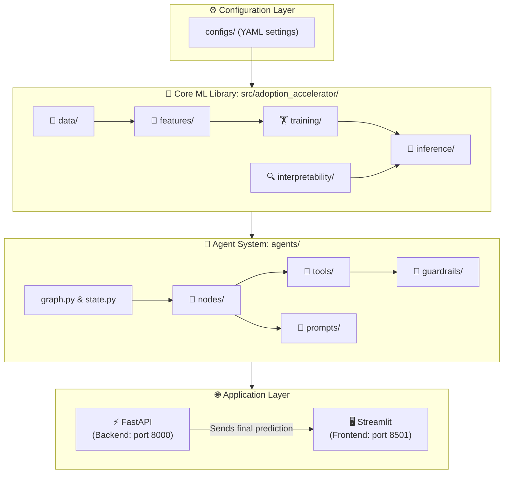
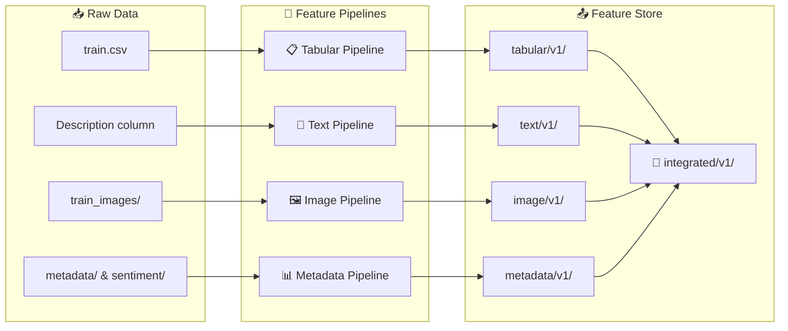
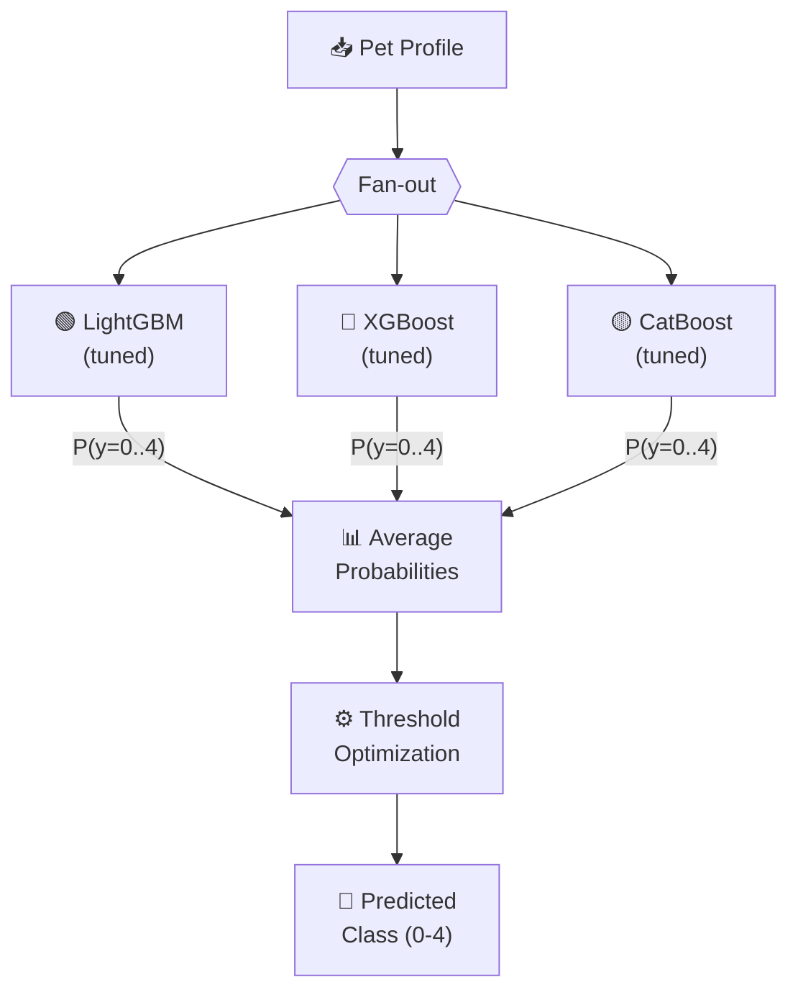
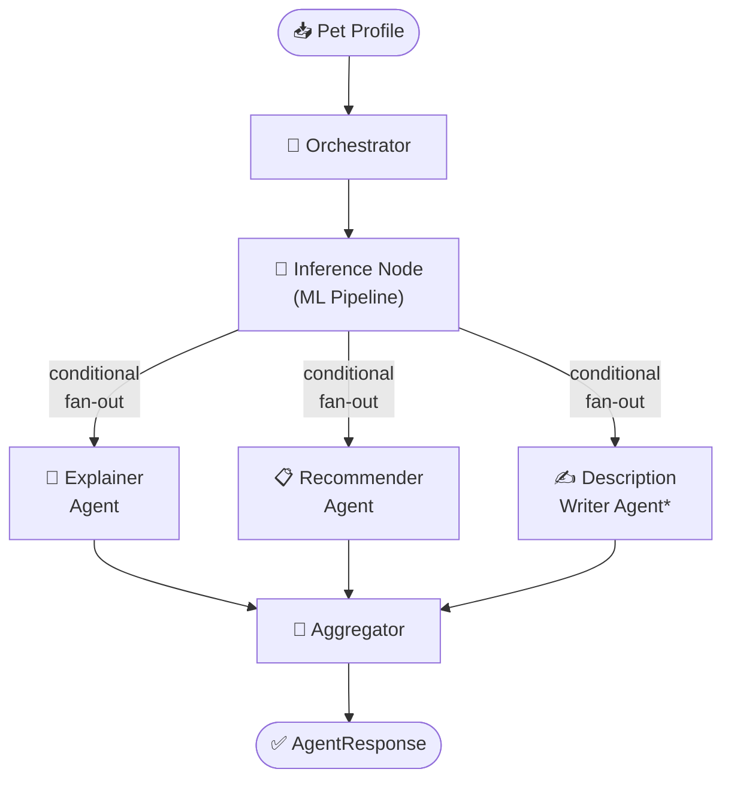
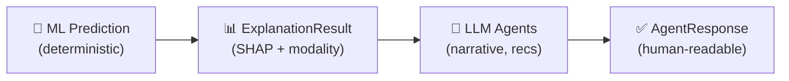

<div align="center">


<a id="adoption-accelerator"></a>
# 🐾 Adoption Accelerator

### Multimodal ML + Generative AI for Pet Adoption Speed Prediction

[](https://www.python.org/downloads/)
[](https://langchain-ai.github.io/langgraph/)
[](https://fastapi.tiangolo.com/)
[](https://streamlit.io/)
[](https://lightgbm.readthedocs.io/)
[](LICENSE)

**How fast will this pet find a home? Fusing Multimodal ML and Generative AI to accelerate adoptions.**

[Features](#features) •
[Architecture](#architecture) •
[Data Pipeline](#data-pipeline) •
[Models](#model-architecture) •
[GenAI Agents](#generative-ai-multi-agent-system) •
[Installation](#installation) •
[Usage](#usage)

</div>

---

## 📖 Overview

Adoption Accelerator is a production-grade, end-to-end machine learning system that predicts how quickly a pet will be adopted from the [PetFinder.my](https://www.kaggle.com/competitions/petfinder-adoption-prediction) platform. By fusing **tabular**, **text**, and **image** data through a multimodal feature engineering pipeline and a soft-voting ensemble of gradient-boosted trees, the system produces precise adoption speed probability distributions alongside rich, interpretable counterfactual explanations.

A downstream **Generative AI orchestration layer**, powered by a LangGraph multi-agent architecture, translates raw model outputs into natural-language narratives, actionable recommendations, and AI-optimized listing descriptions. This effectively closes the loop from prediction to intervention.

> The project demonstrates a hybrid framework where classical machine learning handles the predictive modeling task using rigorous cross-validation and SHAP-based interpretability, while an LLM-based orchestration system consumes these structured outputs to generate human-readable insights. This design bridges the gap between statistical modeling and actionable guidance.

---

<a id="features"></a>
## ✨ Features

<table>
<tr>
<td width="50%">

### 🔬 **Multimodal Prediction**
- Ingests tabular attributes, free-text descriptions, and pet photos
- Predicts adoption speed across five ordinal classes
- Late fusion of independently extracted modality features

</td>
<td width="50%">

### 🏆 **Soft Voting Ensemble**
- Bayesian-tuned LightGBM, XGBoost, and CatBoost
- Soft-voting probability averaging for robust predictions
- QWK threshold optimization for ordinal targets

</td>
</tr>
<tr>
<td width="50%">

### 🧠 **Deep Feature Extraction**
- 768-dim text embeddings (`all-mpnet-base-v2`)
- PCA-reduced image embeddings (`EfficientNet V2-S`)
- Google Vision & NLP API metadata features

</td>
<td width="50%">

### 🔍 **SHAP Interpretability**
- Per-prediction and global SHAP explanations
- Modality-level attribution (tabular, text, image, metadata)
- Counterfactual what-if analysis engine

</td>
</tr>
<tr>
<td width="50%">

### 🤖 **LangGraph Agent System**
- Multi-agent pipeline with fan-out / fan-in topology
- Explainer, Recommender, and Description Writer agents
- Structured tool adapters bridging ML → LLM

</td>
<td width="50%">

### 🌐 **Two-Tier Web Application**
- FastAPI backend serving ML inference + agent graph
- Streamlit frontend for interactive pet profile submission
- Async Phase 2 loading for LLM-generated insights

</td>
</tr>
</table>

---

<a id="architecture"></a>
## 🏗 Architecture

The system is organized into four integrated layers with strict unidirectional dependencies:



### 🎯 Layer Responsibilities

| Layer | Responsibility | Consumers |
|-------|---------------|-----------|
| ⚙️ **Configuration** | Centralized YAML settings for paths, seeds, hyperparameters. Single source of truth. | All layers |
| 🔬 **Core ML Library** | All reusable logic including data ingestion, validation, multimodal feature engineering, model training, inference pipelines, and SHAP interpretability. | Notebooks, App, Agents |
| 📓 **Notebooks** | Interactive research and experimentation environments. Thin orchestration over the core library. | Data scientists |
| 🌐 **Frontend** | Streamlit interface for pet profile submission and prediction display. | End users |
| ⚡ **Backend** | FastAPI service wrapping the inference pipeline and agent graph. REST endpoints for prediction, explanation, and recommendations. | Frontend |
| 🤖 **Agent System** | LangGraph multi-agent layer consuming interpretability outputs to generate explanations and recommendations. | End users (via frontend) |

---

<a id="data-pipeline"></a>
## 📊 Data Pipeline

The system extracts features from four data modalities independently, then fuses them into a single integrated feature matrix for model training.



### 📋 Tabular Features

> **Notebook:** `07_feature_engineering_tabular.ipynb`

| Technique | Details |
|-----------|---------|
| **Binary & ordinal encoding** | Pet type → `is_dog`; Health, MaturitySize, FurLength as ordinal integers |
| **Care recoding** | Vaccinated / Dewormed / Sterilized → {Yes: 1, No: 0, Not Sure: −1}, composite `health_care_score` |
| **Numeric transforms** | Log transforms (`log_age`, `log_fee`), binary flags (`is_free`, `has_photos`), `fee_per_pet` |
| **Name features** | `has_name`, `name_length`, `name_word_count` |
| **Breed features** | `is_mixed_breed`, `breed_count`, `breed1_frequency` (frequency encoding) |
| **Color features** | `color_count`, missing indicators for secondary/tertiary colors |
| **Interaction features** | `age_x_type`, `health_x_vaccinated`, cross-feature interactions |
| **Rescuer aggregation** | Per-rescuer statistics (pet count, mean photo amount) fitted on train |
| **State encoding** | Frequency-based encoding for Malaysian states |

> Statistics fitted on train are applied identically to test to prevent data leakage.

### 📝 Text Features

> **Notebook:** `08_feature_extraction_text.ipynb`

| Component | Model / Method | Output |
|-----------|---------------|--------|
| **Sentence embeddings** | `all-mpnet-base-v2` (MPNet sentence transformer) | 768 dimensions |
| **Handcrafted statistics** | `description_length`, `word_count`, `sentence_count`, `language_detected` | 4+ features |
| **Sentiment aggregation** | Google NLP API: document-level `score` & `magnitude`, sentence-level aggregations | 6+ features |

**Preprocessing:** Null/empty descriptions → canonical placeholder. HTML/URLs stripped, whitespace normalized, Unicode standardized (NFKD). Casing preserved: the sentence-transformer tokenizer handles casing natively.

**Model Selection (`all-mpnet-base-v2`):** The selection of the MPNet architecture (Song et al., 2020), fine-tuned utilizing the Sentence-BERT (SBERT) framework (Reimers & Gurevych, 2019), is fundamentally grounded in its state-of-the-art performance on semantic text similarity (STS) benchmarks. As a comprehensive BERT-class neural language model, it efficiently encapsulates the rich semantic topologies of lengthy pet adoption listing descriptions, robustly processing sequences up to 384 tokens without catastrophic information loss. This robust representation generation is paramount for capturing underlying intent, lexical variations, and emotional tone essential for correlative predictions.

### 🖼️ Image Features

> **Notebook:** `09_feature_extraction_images.ipynb`

| Component | Model / Method | Output |
|-----------|---------------|--------|
| **Deep embeddings** | `EfficientNet V2-S` (torchvision, penultimate layer) | 1,280 → **100** (PCA) |
| **Aggregation** | Mean pooling across all images per PetID | 100 dimensions |
| **Image quality** | `avg_image_brightness`, `avg_image_blur_score` | 2+ features |
| **Auxiliary flags** | `has_image_embedding`, `actual_photo_count` | 2 features |

> PCA (1,280 → 100 dims) fitted on train, applied to both splits. Fitted PCA saved as `image_pca_v1.joblib` for inference reproducibility.

**Model Selection (`EfficientNet V2-S`):** The convolutional neural network (CNN) backbone leverages the EfficientNetV2 architecture (Tan & Le, 2021), rigorously selected for its superior trade-off between parameter efficiency, rapid inference scaling (up to ~450 imgs/sec on modern GPU clusters), and generalization stability via transfer learning. By extracting feature maps from the penultimate dense layer of the unclassified topology, the pipeline projects complex hierarchical visual motifs into a resilient 1,280-dimensional embedding space. This methodology successfully captures nuanced spatial and subjective aesthetic qualities while systematically circumventing the computational overhead and memory bottlenecks typically encountered with large-scale self-attention Vision Transformers.

### 📊 Metadata & Sentiment Features

> **Notebooks:** `08_feature_extraction_text.ipynb` (sentiment) & `09_feature_extraction_images.ipynb` (vision metadata)

| Source | Extracted Features |
|--------|-------------------|
| **Vision API: labels** | Top-N label scores, count above threshold, presence of specific labels |
| **Vision API: colors** | Dominant color RGB, color diversity score, brightness proxy |
| **Vision API: crop hints** | Crop confidence score (image composition quality proxy) |
| **NLP API: sentiment** | Document-level score & magnitude, sentence-level aggregations, entity count |

### 🔗 Feature Fusion

> **Notebook:** `10_feature_integration.ipynb`

All per-PetID feature DataFrames are joined via **late fusion** (horizontal concatenation on `PetID`):

```
integrated/v1/train.parquet = JOIN(tabular, text, image, metadata) ON PetID
```

**Why late fusion?**
- ✅ Tree models handle heterogeneous features natively
- ✅ Preserves modality-independent versioning
- ✅ Enables trivial modal ablation studies
- ✅ Feature importance remains attributable to specific modalities

---

<a id="model-architecture"></a>
## 🏆 Model Architecture

### 📏 Baseline Models

> **Notebook:** `11_modeling_baseline.ipynb`

Five baselines establish the performance floor using **Stratified 5-Fold CV** (`random_state=42`):

| Model | Purpose |
|-------|---------|
| `DummyClassifier` (most frequent) | Lower bound; no learning |
| `DummyClassifier` (stratified) | Random baseline preserving distribution |
| `LogisticRegression` | Linear baseline |
| `DecisionTreeClassifier` | Non-linear baseline (single tree) |
| `LGBMClassifier` (default) | Gradient-boosted baseline |

### ⚡ Hyperparameter Optimization

> **Notebook:** `12_modeling_tuning.ipynb`

Three prominent gradient-boosted decision tree (GBDT) architectures are incorporated into our predictive modeling framework, each systematically initialized and tuned via Tree-structured Parzen Estimator (TPE) Bayesian optimization utilizing Optuna:

| Model Architecture | Trials | Key Hyperparameters Optimized |
|-------------|--------|-------------------|
| **LightGBM** (Ke et al., 2017) | 30 | `learning_rate`, `num_leaves`, `max_depth`, `min_child_samples`, `subsample`, `colsample_bytree`, `reg_alpha`, `reg_lambda`, `min_split_gain` |
| **XGBoost** (Chen & Guestrin, 2016) | 30 | `learning_rate`, `max_depth`, `min_child_weight`, `subsample`, `colsample_bytree`, `gamma`, `reg_alpha`, `reg_lambda` |
| **CatBoost** (Prokhorenkova et al., 2018) | 30 | `learning_rate`, `depth`, `l2_leaf_reg`, `min_data_in_leaf`, `subsample`, `colsample_bylevel`, `random_strength` |

Top-3 candidate configurations per architecture family (9 models in total) were empirically verified through a standard `cross_validate_model` procedure. Regularization diagnostics were applied to flag and systematically prune overfitted models exhibiting evaluation metric disparities (train-vs-validation gap exceeding 0.05 thresholds).

### 🎯 Final Model: Soft Voting Ensemble

The production model utilizes a soft-voting ensemble mechanism combining the optimized instances of LightGBM (Ke et al., 2017), XGBoost (Chen & Guestrin, 2016), and CatBoost (Prokhorenkova et al., 2018). This heterogeneous ensemble effectively leverages the distinct algorithmic strengths of each gradient boosting implementation, specifically handling high-cardinality categorical features intrinsically and mitigating heteroscedastic overfitting through disparate regularization strategies. By uniformly averaging the calibrated probability outputs (soft voting) across the constituent models, the predictive layer achieves superior generalization bounds and statistically significant robustness across the ordinal target space.



### 📈 Performance

| Metric | Score |
|--------|-------|
| **QWK (threshold-optimized)** | **0.4933** |
| QWK (argmax) | 0.4299 |
| Accuracy | 0.4096 |
| Macro F1 | 0.3310 |
| Weighted F1 | 0.4075 |
| Baseline QWK (LightGBM default) | 0.4488 |
| **Improvement over baseline** | **+0.0445 (+9.9%)** |

**🏆 Competitive Standing:**
Our threshold-optimized ensemble achieves a final Quadratic Weighted Kappa (QWK) score of **0.4933**. For context, the first-place winning score on the private leaderboard of the official [Kaggle PetFinder Adoption Prediction competition](https://www.kaggle.com/competitions/petfinder-adoption-prediction/leaderboard) was **0.45338**. This demonstrates the highly competitive and robust predictive power of our multimodal feature engineering pipeline and soft voting ensemble methodology.

### ⚙️ Threshold Optimization

Since AdoptionSpeed is ordinal and QWK penalizes distant misclassifications:

<table>
<tr>
<td width="30px">1️⃣</td>
<td>Compute expected value: <code>E = Σ(i × P(y=i))</code> for each sample</td>
</tr>
<tr>
<td>2️⃣</td>
<td>Optimize 4 threshold boundaries on validation set to maximize QWK</td>
</tr>
<tr>
<td>3️⃣</td>
<td>Store optimized thresholds in <code>thresholds.json</code></td>
</tr>
</table>

> This yields a **+0.063 QWK improvement** over naïve argmax optimization, demonstrating the importance of ordinal-aware decision boundaries for complex predictive modeling.

---

## 🔍 Interpretability Layer

> **Notebook:** `13_interpretability_diagnostics.ipynb`

The interpretability layer constitutes a mathematically foundational component of the architecture, ensuring decision transparency and localized actionability. It critically employs the SHAP (SHapley Additive exPlanations) structural framework, specifically applying the high-speed `TreeExplainer` algebraic variant tailored for tree-ensemble models (Lundberg et al., 2020). This guarantees locally accurate, game-theoretic attributions of feature importance driving individual inference paths.

| Level | Scope | Output |
|-------|-------|--------|
| **Global** | Entire training set (14,993 samples) | Mean \|SHAP\| per feature, per-modality importance, top-K features per class |
| **Local** | Per-prediction at inference time | Per-feature SHAP values, modality attribution, top positive/negative factors |
| **Counterfactual** | Per-prediction "what-if" analysis | Actionable feature changes that would improve adoption speed |

**Modality attribution** aggregates SHAP values by provenance tag, enabling insights like *"image quality contributes 25% to this prediction"*, which acts as a structured input matrix for the downstream LLM orchestration layer.

---

<a id="generative-ai-multi-agent-system"></a>
## 🤖 Generative AI Multi-Agent System

The GenAI orchestration layer bridges the gap between deterministic ML predictions and human-understandable insights. It **does not** retrain or replace the supervised ML model; instead, it consumes the structured interpretability outputs to generate actionable natural-language guidance via a pipeline of specialized agents.

### 🔄 Agent Graph Topology



> *Description Writer only runs when the request carries a non-empty description.

### ⚡ Phase 1: Deterministic (ML)

The inference node runs the complete ML pipeline **synchronously** passing results immediately down the execution graph:

<table>
<tr>
<td width="30px">1️⃣</td>
<td><b>Preprocessor</b>: Raw input mapped to a structured feature matrix using the exact pipeline states fitted during training.</td>
</tr>
<tr>
<td>2️⃣</td>
<td><b>Predictor</b>: Soft-voting ensemble maps the feature vector to class probabilities and calculates threshold-optimized predictions.</td>
</tr>
<tr>
<td>3️⃣</td>
<td><b>Explainer</b>: Evaluates local SHAP values, aggregates modality attribution, and surfaces top driving factors.</td>
</tr>
<tr>
<td>4️⃣</td>
<td><b>Translator</b>: Transforms raw numerical SHAP metrics into heavily structured representations for generative AI consumption.</td>
</tr>
</table>

### 🧠 Phase 2: Generative AI (LLM)

Three LLM-powered agents execute **concurrently** (LangGraph fan-out), then converge on the aggregator (fan-in):

| Agent | Role | Input | Output |
|-------|------|-------|--------|
| **Explainer** | Translates SHAP data into natural-language narratives | Modality attribution, top factors, prediction context | Human-readable text explaining *why* the pet received its predicted speed |
| **Recommender** | Suggests concrete actions to improve adoption speed | Counterfactual analysis, negative factors | Ranked actionable recommendations with expected impact |
| **Description Writer** | Generates optimized listing descriptions | Original description, text SHAP contributions | Rewritten description with language patterns correlated to faster adoption |

### 🌉 The Generative AI Bridge



Key architectural constraints ensuring operational reliability from LLM orchestration:

- ✅ **JSON-serializable**: All diagnostic outputs natively convert into schemas parseable by LLM tool-calling vectors.
- ✅ **Self-descriptive**: Data structures intrinsically define their evaluation context to improve generation coherence.
- ✅ **Modality-tagged**: Individual attribution values explicitly map back to their source modalities via metadata tags.
- ✅ **Actionability-tagged**: Logical constraints distinguish immutable parameters from high-impact intervention opportunities.
- ✅ **Top-K truncated**: Extracted subsets limit complexity and manage total token volumes while maintaining context windows.
- ✅ **Guardrailed**: Custom validation routines structurally suppress hallucinations concerning absent feature sets.

### 🔄 Shared Agent State

```
AgentState:
├── request: PredictionRequest          # Raw user input
├── prediction: PredictionResult        # ML prediction + probabilities
├── explanation: ExplanationResult       # SHAP values + modality attribution
├── interpreted_explanation              # Human-readable SHAP factors
├── narrative_explanation: str           # LLM-generated explanation
├── recommendations: list[Recommendation]# Actionable suggestions
├── improved_description: str | None    # AI-optimized listing text
├── response: AgentResponse             # Final assembled output
├── errors: list[NodeError]             # Error tracking (accumulating)
├── trace: list[TraceEntry]             # Execution trace (accumulating)
└── warnings: list[str]                 # Non-fatal warnings
```

---

## 📁 Project Structure

```
adoption_accelerator/
│
├── 📄 pyproject.toml                         # Project config (uv/pip)
├── 📄 README.md                              # This file
├── 📄 .env                                   # Environment variables
│
├── 📂 configs/                               # ⚙️ Configuration
│   ├── training/                             # Baseline & tuned training configs
│   ├── inference/                            # Serving config (model path, thresholds)
│   └── agents/                               # LLM and agent config
│
├── 📂 src/adoption_accelerator/              # 🔬 Core ML Library
│   ├── config.py                             # YAML loader, path resolver
│   ├── 📂 data/                              # Schemas, ingestion, validation, cleaning
│   ├── 📂 features/                          # Tabular, text, image, metadata pipelines
│   ├── 📂 training/                          # Trainer, evaluation, model selection
│   ├── 📂 inference/                         # Contracts, preprocessor, predictor, pipeline
│   ├── 📂 interpretability/                  # SHAP explainer, counterfactual engine
│   └── 📂 utils/                             # Paths, logging, visualization
│
├── 📂 notebooks/                             # 📓 Research Notebooks (00 to 14)
│   ├── 00_project_setup.ipynb
│   ├── 01_data_ingestion.ipynb
│   ├── 02_data_validation.ipynb
│   ├── 03_data_cleaning.ipynb
│   ├── 04_eda_tabular.ipynb
│   ├── 05_eda_text_sentiment.ipynb
│   ├── 06_eda_images_metadata.ipynb
│   ├── 07_feature_engineering_tabular.ipynb
│   ├── 08_feature_extraction_text.ipynb
│   ├── 09_feature_extraction_images.ipynb
│   ├── 10_feature_integration.ipynb
│   ├── 11_modeling_baseline.ipynb
│   ├── 12_modeling_tuning.ipynb
│   ├── 13_interpretability_diagnostics.ipynb
│   └── 14_inference_pipeline_test.ipynb
│
├── 📂 agents/                                # 🤖 Agent System
│   ├── graph.py                              # LangGraph graph definition (fan-out/fan-in)
│   ├── state.py                              # Shared agent state schema
│   ├── 📂 nodes/                             # Orchestrator, inference, explainer,
│   │                                         #   recommender, description_writer, aggregator
│   └── 📂 tools/                             # Prediction, explanation, feature,
│                                             #   counterfactual tool adapters
│
├── 📂 app/                                   # 🌐 Application
│   ├── 📂 api/                               # FastAPI backend (routers, schemas, services)
│   └── 📂 streamlit/                         # Streamlit frontend (pages, components)
│
├── 📂 data/                                  # 📦 Data & Feature Store
│   ├── 📂 raw/                               # Immutable Kaggle competition data
│   ├── 📂 cleaned/                           # Post-cleaning Parquet files
│   └── 📂 features/                          # Versioned feature store (v1/)
│       ├── tabular/v1/
│       ├── text/v1/
│       ├── image/v1/
│       ├── metadata/v1/
│       └── integrated/v1/                    # Final merged feature matrix
│
├── 📂 artifacts/models/                      # 🏆 Model Artifacts
│   ├── 📂 tuned_v1/                          # Production model bundle
│   │   ├── model.joblib                      # SoftVotingEnsemble (LGB+XGB+CB)
│   │   ├── explainer.joblib                  # Pre-fitted SHAP TreeExplainer
│   │   ├── feature_schema.json               # Feature names, types, modality tags
│   │   ├── config.yaml                       # Full training config snapshot
│   │   ├── metrics.json                      # Cross-validation metrics
│   │   ├── thresholds.json                   # Optimized ordinal thresholds
│   │   └── oof_predictions.parquet           # Out-of-fold predictions
│   └── image_pca_v1.joblib                   # Fitted PCA for image embeddings
│
├── 📂 tests/                                 # ✅ Unit and integration tests
├── 📂 reports/                               # 📊 Figures and metrics
└── 📂 docs/                                  # 📖 Specs, architecture, planning
```

---

<a id="installation"></a>
## 🚀 Installation

### Prerequisites

- **Python** ≥ 3.11
- **uv** (recommended) or **pip** for dependency management
- Trained model bundle in `artifacts/models/tuned_v1/`
- An OpenAI-compatible LLM endpoint

### Quick Setup

```bash
# 1️⃣ Clone the repository
git clone https://github.com/PedroMarkovicz/adoption_accelerator.git
cd adoption_accelerator

# 2️⃣ Install dependencies
pip install -e ".[dev]"
# Or using uv (faster)
uv sync

# 3️⃣ Configure environment variables
cp .env.example .env
# Edit .env with your LLM API key and endpoint
```

### Configuration

```ini
# LLM Configuration (REQUIRED)
OPENAI_API_KEY=sk-proj-...

# Application Settings
APP_ENV=development
LOG_LEVEL=INFO
```

---

<a id="usage"></a>
## 💻 Usage

### Starting the Application

The application uses a two-tier microservice architecture. Start both services sequentially:

```bash
# Terminal 1: FastAPI inference engine and multi-agent backend orchestration
uvicorn app.api.main:app --host 0.0.0.0 --port 8000

# Terminal 2: Streamlit front-end data ingest interface
streamlit run app/streamlit/app.py
```

The application will be available at **http://localhost:8501**

### 📝 Application Flow

<table>
<tr>
<td width="30px">1️⃣</td>
<td><b>Submit Profile</b><br/>Enter tabular constraints, compose a full textual description, and provide rich image structures to initialize a prediction payload.</td>
</tr>
<tr>
<td>2️⃣</td>
<td><b>Phase 1: Deterministic Computing</b><br/>The multimodal framework rapidly scores the data, returning probability distributions alongside global attribute importances directly to the user instance.</td>
</tr>
<tr>
<td>3️⃣</td>
<td><b>Phase 2: LLM Orchestration</b><br/>A distributed array of localized language models dynamically constructs context-aware interventions and copy revisions over automated polling cycles.</td>
</tr>
</table>

### 🎯 Prediction Classes

| Class | Label | Meaning |
|-------|-------|---------|
| 0 | Same-day adoption | Adopted on the same day as listing |
| 1 | Adopted within 1 week | Adopted between 1 to 7 days |
| 2 | Adopted within 1 month | Adopted between 8 to 30 days |
| 3 | Adopted within 1 to 3 months | Adopted between 31 to 90 days |
| 4 | Not adopted (100+ days) | Not adopted after 100 days |

---

## 🛠 Development

### Tech Stack

| Category | Technologies |
|----------|-------------|
| **ML Core** | scikit-learn, LightGBM, XGBoost, CatBoost, SHAP, Optuna |
| **NLP** | sentence-transformers (`all-mpnet-base-v2`), langdetect |
| **Vision** | PyTorch, torchvision (`EfficientNet V2-S`) |
| **Agent System** | LangGraph, OpenAI API |
| **Backend** | FastAPI, Uvicorn, Pydantic |
| **Frontend** | Streamlit |
| **Data** | Pandas, NumPy, PyArrow (Parquet) |
| **Visualization** | Matplotlib, Seaborn, Plotly |

### Tests

```bash
# Unit + schema tests
pytest tests/ -v

# Frontend API tests
pytest tests/frontend_tests/ -v

# E2E integration test (requires running server)
python -m tests.frontend_tests.run_integration
```

### 🔒 Reproducibility Guarantees

| Mechanism | Guarantee |
|-----------|----------|
| `pyproject.toml` + `uv.lock` | Exact dependency versions |
| `configs/*.yaml` | All hyperparameters externalized and version-controlled |
| `data/raw/` immutability | Input data never mutated after download |
| Feature version directories (`v1/`) | Feature transformation reproducibility |
| Model bundle config snapshots | Full training config stored alongside model |
| `random_state=42` | Deterministic splits and model initialization |
| Persisted fold indices (`cv_folds_v1.json`) | Identical CV splits across all experiments |

---

## 📄 License

MIT License

---

<div align="center">

**Built with 🐾 for pets waiting to find their forever homes**

[⬆ Back to top](#-adoption-accelerator)

</div>
