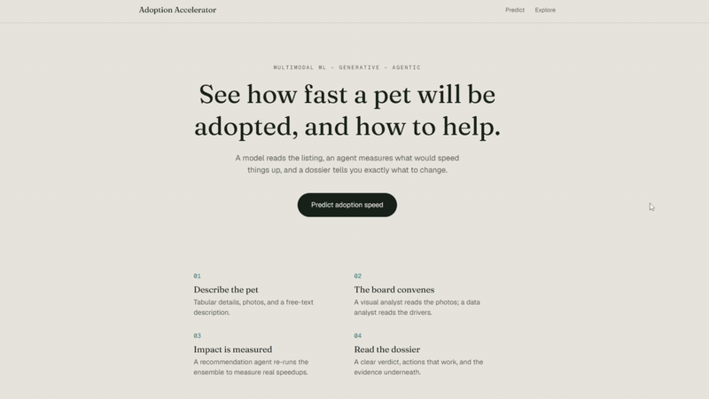
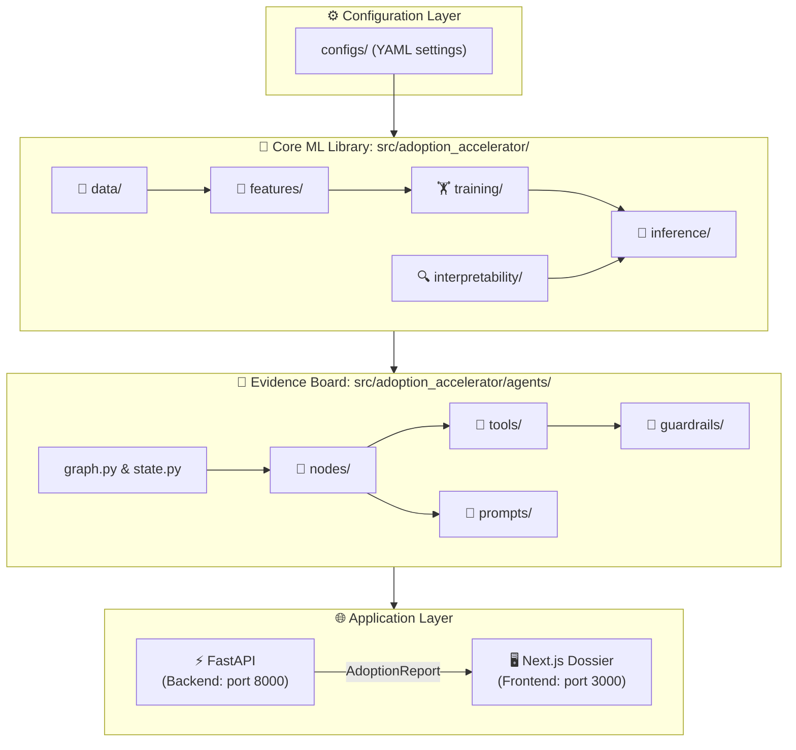
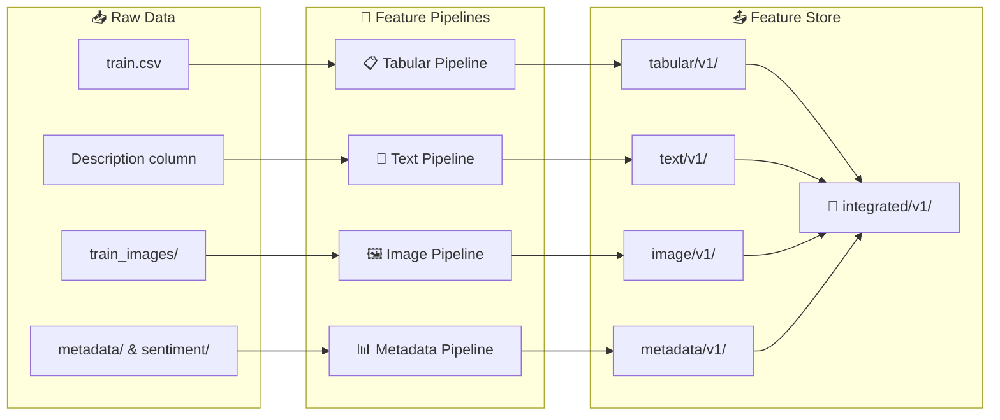
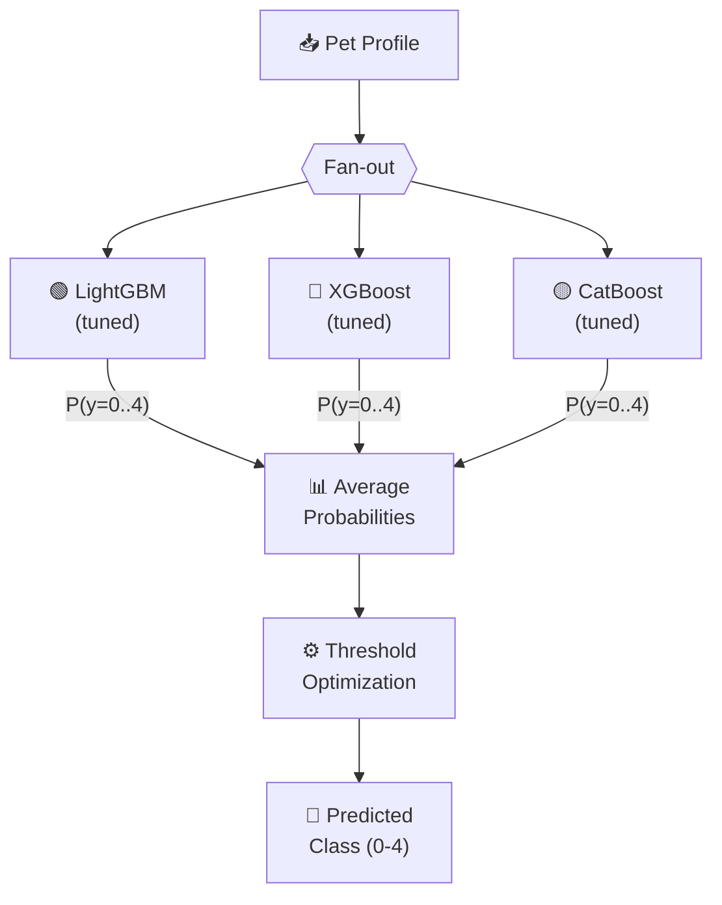
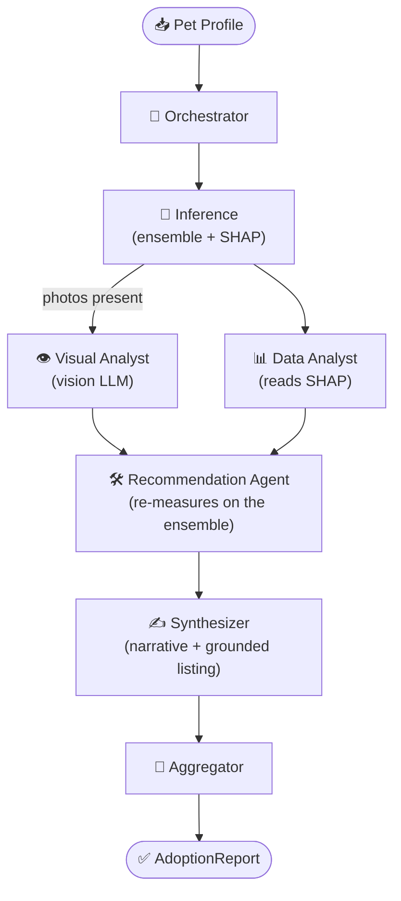

<div align="center">


<a id="adoption-accelerator"></a>
# 🐾 Adoption Accelerator

### Multimodal ML + Agentic Generative AI for Pet Adoption Speed Prediction

[](https://www.python.org/downloads/)
[](https://langchain-ai.github.io/langgraph/)
[](https://fastapi.tiangolo.com/)
[](https://nextjs.org/)
[](https://lightgbm.readthedocs.io/)
[](LICENSE)

**How fast will this pet find a home, and what would make it faster?**

[Features](#features) •
[Architecture](#architecture) •
[Data Pipeline](#data-pipeline) •
[Models](#model-architecture) •
[Agents](#generative-ai-multi-agent-system) •
[Config](#configuration-driven-design) •
[Usage](#usage)

</div>

<p align="center">
  
  <br/>
  <em>Wizard → prediction → the Dossier report → an exported, ready-to-use listing.</em>
</p>

---

## 📖 Overview

Adoption Accelerator predicts how quickly a pet will be adopted on the [PetFinder.my](https://www.kaggle.com/competitions/petfinder-adoption-prediction) platform. It reads three kinds of input at once, tabular attributes, the free-text listing description, and the pet's photos, and runs them through a multimodal feature pipeline and a soft-voting ensemble of gradient-boosted trees. The output is a probability distribution over five adoption-speed classes, plus SHAP explanations that say which features drove the score.

On top of that sits a generative layer: a LangGraph multi-agent system I call the **Evidence Board**. It reads the photos with a vision model, turns the SHAP drivers into plain language, tests improvements against the real ensemble, and writes a rewritten listing. The machine learning produces the numbers; the agents produce the reasoning and the words that a shelter operator can act on.

> The design keeps a clean split. Classical ML owns the prediction, with cross-validation and SHAP interpretability. An LLM system reads those structured outputs and generates the narrative, the recommendations, and the copy. The deterministic prediction always ships, even if every LLM call fails.

---

<a id="features"></a>
## ✨ Features

<table>
<tr>
<td width="50%">

### 🔬 **Multimodal Prediction**
- Reads tabular attributes, text descriptions, and photos
- Predicts adoption speed across five ordinal classes
- Late fusion of features extracted per modality

</td>
<td width="50%">

### 🏆 **Soft Voting Ensemble**
- LightGBM, XGBoost, and CatBoost, tuned with Optuna
- Soft-voting probability averaging
- QWK threshold optimization for the ordinal target

</td>
</tr>
<tr>
<td width="50%">

### 🧠 **Deep Feature Extraction**
- 768-dim text embeddings (`all-mpnet-base-v2`)
- PCA-reduced image embeddings (`EfficientNet V2-S`)
- Google Vision and NLP metadata features

</td>
<td width="50%">

### 🔍 **SHAP Interpretability**
- Per-prediction and global SHAP explanations
- Attribution split by modality (tabular, text, image, metadata)
- Counterfactual what-if analysis

</td>
</tr>
<tr>
<td width="50%">

### 🤖 **Evidence Board Agents**
- LangGraph graph: vision analyst, data analyst, recommender, synthesizer
- Every recommendation is re-measured on the real ensemble, not guessed
- Grounded copy: the writer can only claim traits the vision model saw

</td>
<td width="50%">

### 🖥️ **"The Dossier" Frontend**
- Next.js 16 interface over a typed BFF layer
- Verdict on a Speed Spectrum, each photo paired with its assessment
- Exports a finished listing (ad + evidence brief) to HTML/PDF

</td>
</tr>
</table>

---

<a id="architecture"></a>
## 🏗 Architecture

The system has four layers with one-way dependencies:


```mermaid
graph TB
    subgraph CONFIG["⚙️ Configuration Layer"]
        YAML["configs/ (YAML settings)"]
    end

    subgraph CORE["🔬 Core ML Library: src/adoption_accelerator/"]
        DATA["📂 data/"] --> FEAT["🧩 features/"]
        FEAT --> TRAIN["🏋️ training/"]
        TRAIN --> INF["🎯 inference/"]
        INTERP["🔍 interpretability/"] --> INF
    end

    subgraph AGENTS["🤖 Evidence Board: src/adoption_accelerator/agents/"]
        A_GRAPH["graph.py & state.py"] --> A_NODES["📂 nodes/"]
        A_NODES --> A_TOOLS["📂 tools/"]
        A_NODES --> A_PROMPTS["📂 prompts/"]
        A_TOOLS --> A_GUARD["📂 guardrails/"]
    end

    subgraph APP["🌐 Application Layer"]
        API["⚡ FastAPI\n(Backend: port 8000)"]
        NEXT["🖥️ Next.js Dossier\n(Frontend: port 3000)"]

        API -- "AdoptionReport" --> NEXT
    end

    YAML --> CORE
    CORE --> AGENTS
    AGENTS --> APP
```

### 🎯 Layer responsibilities

| Layer | Responsibility | Consumers |
|-------|---------------|-----------|
| ⚙️ **Configuration** | YAML settings for paths, seeds, hyperparameters, and agent model roles. One source of truth. | All layers |
| 🔬 **Core ML Library** | Data ingestion, validation, multimodal feature engineering, training, inference, and SHAP interpretability. | Notebooks, App, Agents |
| 📓 **Notebooks** | Research and experimentation. Thin orchestration over the core library. | Data scientists |
| 🤖 **Evidence Board** | LangGraph agents that read the ML outputs and the photos, then generate the narrative, recommendations, and listing copy. | Backend |
| ⚡ **Backend** | FastAPI service wrapping the inference pipeline and the agent graph. REST over the whole flow. | Frontend |
| 🖥️ **Frontend** | Next.js "Dossier" for submitting a profile and reading the report. Server-side BFF proxy, OpenAPI-typed. | End users |

---

<a id="data-pipeline"></a>
## 📊 Data Pipeline

Features are extracted from four modalities independently, then joined into one matrix for training.


```mermaid
graph LR
    subgraph INPUT["📥 Raw Data"]
        CSV["train.csv"]
        DESC["Description column"]
        IMG["train_images/"]
        META["metadata/ & sentiment/"]
    end

    subgraph PIPELINES["🔧 Feature Pipelines"]
        TAB["📋 Tabular Pipeline"]
        TXT["📝 Text Pipeline"]
        IMP["🖼️ Image Pipeline"]
        MDP["📊 Metadata Pipeline"]
    end

    subgraph OUTPUT["📤 Feature Store"]
        T_OUT["tabular/v1/"]
        X_OUT["text/v1/"]
        I_OUT["image/v1/"]
        M_OUT["metadata/v1/"]
        INT["🎯 integrated/v1/"]
    end

    CSV --> TAB --> T_OUT
    DESC --> TXT --> X_OUT
    IMG --> IMP --> I_OUT
    META --> MDP --> M_OUT

    T_OUT --> INT
    X_OUT --> INT
    I_OUT --> INT
    M_OUT --> INT
```

### 📋 Tabular features

> **Notebook:** `07_feature_engineering_tabular.ipynb`

| Technique | Details |
|-----------|---------|
| **Binary & ordinal encoding** | Pet type to `is_dog`; Health, MaturitySize, FurLength as ordinal integers |
| **Care recoding** | Vaccinated / Dewormed / Sterilized to {Yes: 1, No: 0, Not Sure: −1}, composite `health_care_score` |
| **Numeric transforms** | Log transforms (`log_age`, `log_fee`), binary flags (`is_free`, `has_photos`), `fee_per_pet` |
| **Name features** | `has_name`, `name_length`, `name_word_count` |
| **Breed features** | `is_mixed_breed`, `breed_count`, `breed1_frequency` (frequency encoding) |
| **Color features** | `color_count`, missing indicators for secondary and tertiary colors |
| **Interaction features** | `age_x_type`, `health_x_vaccinated`, cross-feature interactions |
| **Rescuer aggregation** | Per-rescuer statistics (pet count, mean photo amount) fitted on train |
| **State encoding** | Frequency encoding for Malaysian states |

> Statistics fitted on train are applied to test the same way, so nothing leaks across the split.

### 📝 Text features

> **Notebook:** `08_feature_extraction_text.ipynb`

| Component | Model / Method | Output |
|-----------|---------------|--------|
| **Sentence embeddings** | `all-mpnet-base-v2` (MPNet sentence transformer) | 768 dimensions |
| **Handcrafted statistics** | `description_length`, `word_count`, `sentence_count`, `language_detected` | 4+ features |
| **Sentiment aggregation** | Google NLP API: document `score` and `magnitude`, sentence-level aggregations | 6+ features |

**Preprocessing:** empty descriptions become a canonical placeholder. HTML and URLs are stripped, whitespace is normalized, Unicode is standardized (NFKD). Casing is left alone because the sentence-transformer tokenizer handles it.

**Why `all-mpnet-base-v2`:** MPNet (Song et al., 2020), fine-tuned with the Sentence-BERT framework (Reimers & Gurevych, 2019), scores well on semantic text similarity benchmarks and handles sequences up to 384 tokens. That covers most listing descriptions in one pass and gives a representation that carries tone and intent, both of which correlate with how a listing performs.

### 🖼️ Image features

> **Notebook:** `09_feature_extraction_images.ipynb`

| Component | Model / Method | Output |
|-----------|---------------|--------|
| **Deep embeddings** | `EfficientNet V2-S` (torchvision, penultimate layer) | 1,280 to **100** (PCA) |
| **Aggregation** | Mean pooling across all images per PetID | 100 dimensions |
| **Image quality** | `avg_image_brightness`, `avg_image_blur_score` | 2+ features |
| **Auxiliary flags** | `has_image_embedding`, `actual_photo_count` | 2 features |

> PCA (1,280 to 100 dims) is fitted on train and applied to both splits. The fitted PCA is saved as `image_pca_v1.joblib` so inference stays reproducible.

**Why `EfficientNet V2-S`:** EfficientNetV2 (Tan & Le, 2021) gives a good accuracy-per-parameter ratio and runs fast, which matters when embedding thousands of photos. Features come from the penultimate layer, so the 1,280-dim embedding captures composition and visual quality without the memory cost of a large Vision Transformer.

### 📊 Metadata & sentiment features

> **Notebooks:** `08_feature_extraction_text.ipynb` (sentiment) & `09_feature_extraction_images.ipynb` (vision metadata)

| Source | Extracted Features |
|--------|-------------------|
| **Vision API: labels** | Top-N label scores, count above threshold, presence of specific labels |
| **Vision API: colors** | Dominant color RGB, color diversity score, brightness proxy |
| **Vision API: crop hints** | Crop confidence score (a proxy for composition quality) |
| **NLP API: sentiment** | Document score and magnitude, sentence-level aggregations, entity count |

### 🔗 Feature fusion

> **Notebook:** `10_feature_integration.ipynb`

The per-PetID DataFrames are joined by **late fusion**, a horizontal concatenation on `PetID`:

```
integrated/v1/train.parquet = JOIN(tabular, text, image, metadata) ON PetID
```

**Why late fusion:**
- Tree models handle heterogeneous features natively
- Each modality stays independently versioned
- Modal ablation studies are trivial to run
- Feature importance stays attributable to a specific modality

---

<a id="model-architecture"></a>
## 🏆 Model Architecture

### 📏 Baseline models

> **Notebook:** `11_modeling_baseline.ipynb`

Five baselines set the performance floor using **Stratified 5-Fold CV** (`random_state=42`):

| Model | Purpose |
|-------|---------|
| `DummyClassifier` (most frequent) | Lower bound, no learning |
| `DummyClassifier` (stratified) | Random baseline that keeps the class distribution |
| `LogisticRegression` | Linear baseline |
| `DecisionTreeClassifier` | Non-linear baseline (single tree) |
| `LGBMClassifier` (default) | Gradient-boosted baseline |

### ⚡ Hyperparameter optimization

> **Notebook:** `12_modeling_tuning.ipynb`

Three gradient-boosted decision tree libraries are tuned with Tree-structured Parzen Estimator (TPE) search in Optuna:

| Model | Trials | Key hyperparameters |
|-------------|--------|-------------------|
| **LightGBM** (Ke et al., 2017) | 30 | `learning_rate`, `num_leaves`, `max_depth`, `min_child_samples`, `subsample`, `colsample_bytree`, `reg_alpha`, `reg_lambda`, `min_split_gain` |
| **XGBoost** (Chen & Guestrin, 2016) | 30 | `learning_rate`, `max_depth`, `min_child_weight`, `subsample`, `colsample_bytree`, `gamma`, `reg_alpha`, `reg_lambda` |
| **CatBoost** (Prokhorenkova et al., 2018) | 30 | `learning_rate`, `depth`, `l2_leaf_reg`, `min_data_in_leaf`, `subsample`, `colsample_bylevel`, `random_strength` |

The top three configurations per family (nine models total) are re-checked with a `cross_validate_model` pass, which records a train-to-validation QWK gap for each one as an overfitting diagnostic.

> **On that gap:** it is reported, not enforced. Every tuned model here memorizes the training folds — LightGBM reaches a train QWK of ~0.999 against ~0.43 on validation, XGBoost ~0.96, CatBoost ~0.83. That is ordinary for gradient-boosted trees on this many features, and it is why model selection is driven by the cross-validated score rather than by the gap.

### 🎯 Final model: soft voting ensemble

The production model averages the predicted probabilities of the tuned LightGBM, XGBoost, and CatBoost. Each library handles the data a little differently (CatBoost is strong on high-cardinality categoricals, the three use different regularization), so averaging their probabilities is steadier than any single model across the ordinal target.

> **Why the ensemble, when a single model scores higher.** `xgboost_top3` reaches 0.4979 QWK and `lightgbm_top3` 0.4966, against the ensemble's 0.4933. That gap is 0.0046 — less than half of one fold-level standard deviation. `xgboost_top3` swings by ±0.0104 across folds and its worst fold (0.4832) falls below the ensemble's mean, so its lead is inside the noise. The ensemble is shipped for the lower variance, not the higher mean.


```mermaid
graph TB
    INPUT["📥 Pet Profile"] --> SPLIT{{"Fan-out"}}

    SPLIT --> LGBM["🟢 LightGBM\n(tuned)"]
    SPLIT --> XGB["🔵 XGBoost\n(tuned)"]
    SPLIT --> CB["🟡 CatBoost\n(tuned)"]

    LGBM --> |"P(y=0..4)"| AVG["📊 Average\nProbabilities"]
    XGB --> |"P(y=0..4)"| AVG
    CB --> |"P(y=0..4)"| AVG

    AVG --> THRESH["⚙️ Threshold\nOptimization"]
    THRESH --> PRED["🎯 Predicted\nClass (0-4)"]
```

### 📈 Performance

| Metric | Score |
|--------|-------|
| **QWK (threshold-optimized)** | **0.4933** |
| QWK (argmax) | 0.4299 |
| Accuracy | 0.4096 |
| Macro F1 | 0.3310 |
| Weighted F1 | 0.4075 |
| Baseline QWK (LightGBM default) | 0.4488 |
| **Improvement over baseline** | **+0.0445 (+9.9%)** |

**Competitive standing:** the threshold-optimized ensemble reaches a Quadratic Weighted Kappa of **0.4933**. The first-place private-leaderboard score in the official [Kaggle PetFinder Adoption Prediction competition](https://www.kaggle.com/competitions/petfinder-adoption-prediction/leaderboard) was **0.45338**, which puts this pipeline in the range of the top competition entries.

> **Read that comparison carefully.** The two numbers are not measured the same way. 0.4933 is a 5-fold cross-validated score with the decision thresholds fitted on the same validation folds it is reported on, which biases it upward. The Kaggle figure is a single held-out private test set. The comparison is a sanity check on the order of magnitude, not a like-for-like ranking.

### ⚙️ Threshold optimization

AdoptionSpeed is ordinal and QWK punishes far-off misclassifications, so argmax is not the best decision rule:

<table>
<tr>
<td width="30px">1️⃣</td>
<td>Compute the expected value <code>E = Σ(i × P(y=i))</code> for each sample</td>
</tr>
<tr>
<td>2️⃣</td>
<td>Fit four threshold boundaries on the validation set to maximize QWK</td>
</tr>
<tr>
<td>3️⃣</td>
<td>Store the thresholds in <code>thresholds.json</code></td>
</tr>
</table>

> This adds **+0.063 QWK** over plain argmax, which is why ordinal-aware boundaries matter here.

---

## 🔍 Interpretability Layer

> **Notebook:** `13_interpretability_diagnostics.ipynb`

Interpretability is part of the design, not an afterthought. It uses SHAP (Lundberg et al., 2020) with the fast `TreeExplainer` variant for tree ensembles, which gives locally accurate, game-theoretic feature attributions for each prediction.

> **What the explainer is fitted on.** SHAP has no native support for the soft-voting wrapper, so `TreeExplainer` is fitted on the LightGBM base learner (`interpretability/explainer.py`). The attributions describe a representative member of the ensemble rather than the averaged model that produces the shipped probability.

| Level | Scope | Output |
|-------|-------|--------|
| **Global** | Whole training set (14,993 samples) | Mean \|SHAP\| per feature, per-modality importance, top-K features per class |
| **Local** | Per prediction at inference time | Per-feature SHAP values, modality attribution, top positive and negative factors |
| **Counterfactual** | Per-prediction what-if analysis | Feature changes that would improve adoption speed |

**Modality attribution** groups SHAP values by their source tag, so you can say something like *"image quality accounts for 25% of this prediction."* That grouped, tagged structure is exactly what the agent layer reads downstream.

---

<a id="generative-ai-multi-agent-system"></a>
## 🤖 Generative AI Multi-Agent System

The generative layer connects the ML prediction to language a person can use. It does not retrain or replace the model. It reads the structured outputs (and the photos) and generates guidance through a set of specialized agents, the **Evidence Board**.

### 🔄 Agent graph topology


```mermaid
graph TB
    Start(["📥 Pet Profile"]) --> ORCH["🚪 Orchestrator"]
    ORCH --> INF["🎯 Inference\n(ensemble + SHAP)"]

    INF --> |"photos present"| VIS["👁️ Visual Analyst\n(vision LLM)"]
    INF --> DATA["📊 Data Analyst\n(reads SHAP)"]

    VIS --> REC["🛠️ Recommendation Agent\n(re-measures on the ensemble)"]
    DATA --> REC

    REC --> SYN["✍️ Synthesizer\n(narrative + grounded listing)"]
    SYN --> AGG["🔗 Aggregator"]
    AGG --> END(["✅ AdoptionReport"])
```

### ⚡ Phase 1: deterministic (ML)

The inference node runs the full ML pipeline synchronously and passes the result down the graph:

<table>
<tr>
<td width="30px">1️⃣</td>
<td><b>Preprocessor</b>: raw input is mapped to the feature matrix using the exact states fitted during training.</td>
</tr>
<tr>
<td>2️⃣</td>
<td><b>Predictor</b>: the soft-voting ensemble returns class probabilities and the threshold-optimized class.</td>
</tr>
<tr>
<td>3️⃣</td>
<td><b>Explainer</b>: local SHAP values are computed, grouped by modality, and reduced to the top drivers.</td>
</tr>
</table>

### 🧠 Phase 2: generative (LLM)

The agents run on top of the deterministic result. Each one has a narrow job:

| Agent | Job | Reads | Produces |
|-------|------|-------|--------|
| **Visual Analyst** | Looks at the uploaded photos with a vision model | The images themselves | Per-photo quality and appeal, best-photo pick, observed traits |
| **Data Analyst** | Turns the SHAP drivers into plain language | Modality attribution, top factors | A readable account of what pushed the prediction up or down |
| **Recommendation Agent** | Proposes changes and tests them | Drivers, current profile | Ranked actions, each with an impact **re-measured on the real ensemble** |
| **Synthesizer** | Writes the report copy | Everything above | Narrative, headline, and a rewritten listing description |

### 🌉 What keeps the generative layer honest

- **Measured, not estimated.** When the recommender says "add a second clear photo moves this up a class," that number comes from re-running the actual ensemble with the change applied, not from the LLM's guess. The summary shown to the user is derived from the measured probability shift, so a change that moves nothing is reported as no measurable change, and one that moves the wrong way is reported as moving the wrong way.
- **Grounded copy.** The synthesizer can only mention visual traits the vision model actually reported. If a trait was not observed, the rewritten description drops it.
- **Deterministic core always present.** The prediction and SHAP always ship. If the vision model or an LLM call fails, the report still renders and states plainly what was unavailable, rather than inventing content.
- **Per-role models, set in YAML.** Which model runs each node, and its reasoning effort and timeout, lives in `configs/agents/`. Swapping a model is a config edit.

### 🔄 Shared agent state

```
AgentState:
├── request: PredictionRequest              # Raw user input (tabular, text, images)
├── prediction_evidence: PredictionEvidence  # ML prediction, probabilities, SHAP drivers
├── visual_evidence: VisualEvidence | None   # Per-photo assessment from the vision model
├── recommendation_evidence: RecommendationEvidence | None  # Actions with measured impact
├── narrative: str                           # Synthesizer narrative
├── optimized_description: str | None        # Rewritten, grounded listing text
├── headline: str                            # One-line verdict
├── errors: list[NodeError]                  # Per-node error tracking
└── trace: list[TraceEntry]                  # Execution trace (timing, model, cost)
```

The aggregator folds this into a single `AdoptionReport` (with metadata for timing, cost, and image count). Runs are traced with Langfuse.

---

<a id="configuration-driven-design"></a>
## ⚙️ Configuration-Driven Design

Model and agent organization lives in declarative YAML under `configs/`, so most changes are a config edit rather than a code change:

| File | Governs |
|------|---------|
| `configs/training/{baseline,tuned}.yaml` | Cross-validation, Optuna trial budgets, reproducibility seeds, validation gates |
| `configs/inference/serving.yaml` | Model bundle path, expected dimensions, latency targets, class labels, diagnostics |
| `configs/agents/models.yaml` | LLM catalog (pricing, vision support), defaults, and per-role model assignment |
| `configs/agents/timeouts.yaml` | Per-node timeout budgets |

> `models.yaml` reads like a catalog plus a role map. Assigning a vision-capable model to the visual analyst, or raising the synthesizer to a stronger model, is one line of YAML. Adding a new provider or model is a catalog entry, not a code change.

---

## 📁 Project Structure

```
adoption_accelerator/
│
├── 📄 pyproject.toml                         # Project config (uv/pip)
├── 📄 README.md                              # This file
├── 📄 docker-compose.yml                     # Container orchestration
│
├── 📂 configs/                               # ⚙️ Declarative YAML config
│   ├── training/                             # Baseline & tuned training configs
│   ├── inference/                            # Serving config (bundle, thresholds, latency)
│   └── agents/                               # LLM catalog, per-role models, timeouts
│
├── 📂 src/adoption_accelerator/              # 🔬 Core ML + agent library
│   ├── config.py                             # YAML loader, path resolver
│   ├── 📂 data/                              # Schemas, ingestion, validation, cleaning
│   ├── 📂 features/                          # Tabular, text, image, metadata pipelines
│   ├── 📂 training/                          # Trainer, evaluation, model selection
│   ├── 📂 inference/                         # Contracts, preprocessor, predictor, pipeline
│   ├── 📂 interpretability/                  # SHAP explainer, counterfactual engine
│   └── 📂 agents/                            # 🤖 Evidence Board
│       ├── graph.py & state.py               # LangGraph graph + shared state
│       ├── contracts.py                      # AdoptionReport and evidence types
│       ├── 📂 nodes/                         # orchestrator, inference, visual_analyst,
│       │                                     #   data_analyst, recommendation_agent,
│       │                                     #   synthesizer, aggregator
│       ├── 📂 tools/                         # Prediction and measurement adapters
│       ├── 📂 prompts/                       # Per-role system prompts
│       └── 📂 guardrails/                    # Grounding and validation
│
├── 📂 notebooks/                             # 📓 Research notebooks (00 to 14)
│                                             #   data → features → modeling → inference
│
├── 📂 app/api/                               # ⚡ FastAPI backend over the agent graph
├── 📂 frontend/                              # 🖥️ Next.js "Dossier" interface
│
├── 📂 data/                                  # 📦 Raw, cleaned, and versioned feature store
│   └── 📂 features/                          # tabular/ text/ image/ metadata/ integrated/ (v1)
│
├── 📂 artifacts/models/                      # 🏆 Model artifacts
│   ├── 📂 tuned_v1/                          # Production bundle: model, explainer,
│   │                                         #   feature_schema, config.yaml, thresholds,
│   │                                         #   metrics, oof_predictions
│   └── image_pca_v1.joblib                   # Fitted PCA for image embeddings
│
├── 📂 tests/                                 # ✅ pytest (backend + agents)
├── 📂 reports/                               # 📊 Figures and metrics
└── 📂 docs/                                  # 📖 Specs, architecture, planning
```

---

<a id="installation"></a>
## 🚀 Installation

### Prerequisites

- **Python** ≥ 3.11
- **Node.js** ≥ 20 (for the frontend)
- **uv** (recommended) or **pip** for Python dependencies
- A trained model bundle in `artifacts/models/tuned_v1/`
- An OpenAI API key (for the generative layer)

### Setup

```bash
# 1. Clone the repository
git clone https://github.com/PedroMarkovicz/adoption_accelerator.git
cd adoption_accelerator

# 2. Install Python dependencies
uv sync                 # or: pip install -e ".[dev]"

# 3. Configure environment variables
cp .env.example .env    # then add your OPENAI_API_KEY
```

```ini
# .env (repo root)
OPENAI_API_KEY=sk-proj-...
LOG_LEVEL=INFO
```

---

<a id="usage"></a>
## 💻 Usage

### Starting the application

Two processes. Full frontend setup is in [`frontend/README.md`](frontend/README.md).

```bash
# Terminal 1: FastAPI backend (loads the ML model, compiles the agent graph)
uvicorn app.api.main:app --port 8000

# Terminal 2: Next.js frontend
cd frontend && npm install && npm run dev
```

Open **http://localhost:3000**. With an `OPENAI_API_KEY` set, the generative layers run; without one, the deterministic prediction still renders and the UI says what was skipped.

### 📝 Application flow

<table>
<tr>
<td width="30px">1️⃣</td>
<td><b>Submit a profile</b><br/>Fill the wizard with tabular attributes, a description, and photos.</td>
</tr>
<tr>
<td>2️⃣</td>
<td><b>Prediction</b><br/>The ensemble scores the profile and returns probabilities and SHAP drivers.</td>
</tr>
<tr>
<td>3️⃣</td>
<td><b>Report</b><br/>The Dossier shows the verdict on a Speed Spectrum, pairs each photo with its assessment, lists measured recommendations, and exports a finished listing.</td>
</tr>
</table>

### 🎯 Prediction classes

| Class | Label | Meaning |
|-------|-------|---------|
| 0 | Same-day adoption | Adopted on the day it was listed |
| 1 | Adopted within 1 week | 1 to 7 days |
| 2 | Adopted within 1 month | 8 to 30 days |
| 3 | Adopted within 1 to 3 months | 31 to 90 days |
| 4 | Not adopted (100+ days) | Still listed after 100 days |

---

## 🛠 Development

### Tech stack

| Category | Technologies |
|----------|-------------|
| **ML Core** | scikit-learn, LightGBM, XGBoost, CatBoost, SHAP, Optuna |
| **NLP** | sentence-transformers (`all-mpnet-base-v2`), langdetect |
| **Vision** | PyTorch, torchvision (`EfficientNet V2-S`) |
| **Agents** | LangGraph, LangChain, OpenAI (GPT-5 family), Langfuse |
| **Backend** | FastAPI, Uvicorn, Pydantic |
| **Frontend** | Next.js 16, React 19, TypeScript, TanStack Query, Zod |
| **Data** | Pandas, NumPy, PyArrow (Parquet) |
| **Tooling** | uv, Docker Compose, pytest, Vitest, Playwright |

### Tests

```bash
# Backend + agents
pytest tests/ -q

# Frontend (from frontend/)
npm run test          # Vitest unit tests
npx playwright test   # end-to-end (needs the backend running)
```

### 🔒 Reproducibility

| Mechanism | Guarantee |
|-----------|----------|
| `pyproject.toml` + `uv.lock` | Exact dependency versions |
| `configs/*.yaml` | Hyperparameters and model roles externalized and version-controlled |
| `data/raw/` immutability | Input data is never mutated after download |
| Feature version directories (`v1/`) | Reproducible feature transformations |
| Model bundle config snapshots | Full training config stored with the model |
| `random_state=42` | Deterministic splits and model initialization |
| Persisted fold indices (`cv_folds_v1.json`) | Identical CV splits across experiments |

---

## 📄 License

MIT License. See [LICENSE](LICENSE).

---

<div align="center">

**Built with 🐾 for pets waiting to find their homes**

[⬆ Back to top](#-adoption-accelerator)

</div>
